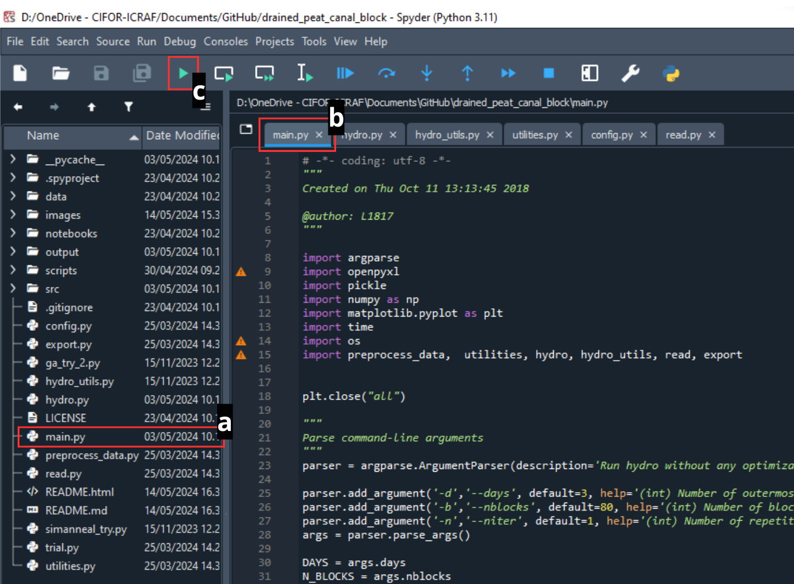

# Drained Peat Canal Block Simulator

The Drained Peat Canal Block Simulator is an open-source model modified from a research by Urzainki et al. (2020). The original model by Urzainki et al. is a tropical peat hydrological model designed to simulate the effect of canal blocking on peat water table depth. This model has the potential to inform the impact of peatland restoration efforts in drained tropical peatlands through canal blocking, which can consequently lead to reduced peat decomposition and a subsequent reduction in GHG emissions.

This repository, the Drained Peat Canal Block Simulator, aims to extend the functionalities of the original model. It makes running simulations and managing multiple canal-blocking scenarios more structured, easier to track, and simpler to compare results across different scenarios. Additionally, we have enhanced the outputs of the simulations by adding new features, including various plots, graphs, and maps that illustrate the impact of canal blocking on changes in water table depth (WTD) and GHG emissions.

## Getting Started

### What you know before you start

This script runs on Python 3. Users should have some basic knowledge of Python. If you are new to Python, it is recommended to start with the [official Python tutorial](https://docs.python.org/3/tutorial/). You will need to know how to read and write data from files.

We have modified the script to make it more accessible and easier to use than the original model. You can simply adjust the data and parameters in the YAML file. We have annotated the scripts to help you fully understand them. We recommend starting with the 'main.py' file. It is strongly advised to read both the code and the original paper thoroughly to understand the components and mechanics of the model.

## Installation Guide

Before using the model, you need to follow these installation steps. Here is a step-by-step guide:

### Step 1: Get the Model Codebase

First, you need to have the codebase on your local computer by downloading the code files or forking the repository, as described in this [guideline step](https://docs.github.com/en/pull-requests/collaborating-with-pull-requests/working-with-forks/fork-a-repo). Make sure to locate the codebase in your desired location.

### Step 2: Install Miniconda

Download and install [Miniconda](https://docs.conda.io/en/latest/miniconda.html) for your operating system. You can follow the installation instructions provided [here](https://github.com/SmithsonianWorkshops/CodingInPython/blob/master/Week%200/Installing%20miniconda%20on%20Windows.md).

### Step 3: Open Anaconda Prompt

After installing Miniconda, open the Anaconda Prompt from your Start Menu.

### Step 4: Create a New Conda Environment

Use the following command to create the conda environment from the `canal-block_environment.yml` file. Make sure the `.yml` file is in your current directory or provide the full path to the file.

``` sh
conda env create -f canal-block_environment.yml
```

### Step 5: Activate the Conda Environment

Once the environment is created, activate it using the following command:

``` sh
conda activate canal-block
```

You can verify the installation by checking the list of installed packages:

``` sh
conda list
```

### Step 6: Install Spyder (if not already installed) as an IDE

To run the model, you can utilize an integrated development environment (IDE) like [Spyder](https://github.com/spyder-ide/spyder). However, feel free to pick your preferred IDE.

If Spyder is not already installed, you can install it using Conda. Run the following command:

``` sh
conda install spyder
```

You can open Spyder directly from the Anaconda Navigator or from the Command Prompt/Anaconda Prompt by typing:

``` sh
spyder
```

### Step 7: Configure Spyder to Use the `canal-block` Environment

1.  **Open Preferences**: In Spyder, go to `Tools` \> `Preferences`.

2.  **Python Interpreter**:

    -   In the Preferences window, navigate to `Python interpreter` under the `Preferences` section on the left.
    -   Select the option `Use the following Python interpreter`.
    -   Browse to the Python interpreter in the `canal-block` environment. To find the path to the Python interpreter, you can use the following command in the Anaconda Prompt while the `canal-block` environment is activated:

    ``` sh
    where python
    ```

    This will output the path to the Python executable, which you can then use in the Spyder configuration.

3.  **Apply and Restart**:

    -   Click `Apply` and then `OK`.
    -   Restart Spyder to apply the changes.

### Step 8: Verify the Environment in Spyder

To verify that Spyder is using the `canal-block` environment, you can run a simple command in the Spyder IPython console:

``` python
import sys
print(sys.executable)
```

This should print the path to the Python executable in the `canal-block` environment.

### Step 9: Test the Peat Hydrological Model

1.  To test the model, you need to open the codebase project. In Spyder, go to `Projects` \> `Open Project` and then choose the `drained_peat_canal_block` folder in the location you selected before.

2.  After the project opens, follow these steps:

    a.  Open the `main.py` file.
    b.  Ensure the `main.py` tab is selected.
    c.  Run the model and wait for the output.

    

    A successful run will produce a plot similar to the one below.

    

    The model output includes four main maps: `DEM`, canal water level (`CWL`), `D`, and `elevation-phi`. The DEM shows the height of the peat surface and helps understand water flow and how canal blocks affect water levels. The `CWL` measures water in the canal network, starting out even but changing after blocks are added, which then affects the water table depth (WTD) in the model. The parameter `D` indicates transmissivity, showing how easily water moves through the peat, based on the slope between the WTD and the peat surface. The elevation-phi plot shows the difference between land height and WTD, with positive values indicating areas where dry peat can form.

    If the plot results do not show up or an error message occurs, please investigate and refer to the [common error solutions](https://github.com/icraf-indonesia/drained_peat_canal_block/blob/write-readme/src/common-error.md). If the error persists, feel free to create an issue in this GitHub repository.

## Data & Parameters

The script needs the following data to run.

| No  | Data                                  | Type    | Format  | Parameter           | Description                                                                                                                                                                                                                                                                                                                                                   | Unit                                     |
|--------|--------|--------|--------|--------|------------------------|--------|
| 1   | Elevation map                         | Raster  | GeoTIFF | `dem_rst_fn`        | elevation data for the entire study area                                                                                                                                                                                                                                                                                                                      | meters (*m*)                             |
| 2   | Peat canal network map                | Raster  | GeoTIFF | `can_rst_fn`        | indicates the location of canals within the study area                                                                                                                                                                                                                                                                                                        | integer (*1:canal present & 0:no canal*) |
| 3   | Peat depth and soil type map          | Raster  | GeoTIFF | `peat_depth_rst_fn` | information about the depth of the peat layer at each location                                                                                                                                                                                                                                                                                                | meters (*m*)                             |
| 4   | Daily precipitation                   | Tabular | .xlsx   | `rainfall_fn`       | excel file containing daily precipitation data for the simulation period                                                                                                                                                                                                                                                                                      | milimeters per day (*mm/day*)            |
| 5   | Information about specific parameters | YAML    | .yml    | `params_fn`         | The specific parameters: block_height (*m*), canal_water_level (m), diri_bc (the dirichlet boundary condition value, *m*), hini (the initial hydraulic head, *m*), P (average precipitation rate, *mm/day*), ET (evapotranspiration rate, *mm/day*), timeStep (time step for the transient simulation, in days), & Kadjust (hydraulic conductivity, unitless) | \-                                       |

In addition to the required data, several parameters must be defined to run the model. These parameters need to be set in a YAML file before running the model. The parameters should be adjusted according to the simulation scenario that the user wants to run. The following table lists these parameters as defined in the YAML file.

| No  | Parameter Name                                         | Description                                                                                                                                                                                                                 | Format                              | Unit                                |
|------------|------------|-------------------------|------------|------------|
| 1   | `DAYS`                                                 | Number of days to simulate the model                                                                                                                                                                                        | Integer                             | days                                |
| 2   | `N_BLOCKS`                                             | Number of canal blocks to be placed in the peatland                                                                                                                                                                         | Integer                             | number of blocks                    |
| 3   | `N_ITER`                                               | Number of iterations for the Monte Carlo simulation or optimization algorithm, influencing the search for optimal dam placements. In the case of Monte Carlo, this specifies how many random dam configurations to evaluate | Integer                             | number of iterations or generations |
| 4   | `track_WT_drained_area` and `track_WT_notdrained_area` | Coordinates (row and column) of specific pixels within the DEM, allowing you to monitor the water table depth at specific locations and analyze the spatial variability of rewetting                                        | Tuple of two integers (row, column) | pixel coordinates                   |
| 5   | `hand_made_dams`                                       | A Boolean flag indicating whether to use hand-picked dam locations for evaluation instead of using the optimization algorithms or random placement.                                                                         | Boolean                             | `True` or `False`                   |

### Data & Parameters Preparation

There are certain guidelines you need to follow to prepare data for simulation:

1.  Define the area of interest (AOI) by providing a base map that will be used as a reference for all raster data. This ensures that all raster data will share the same extent, cell size, and number of columns and rows after being clipped by the base map. This consistency is essential for uniform data processing in the model.

2.  For optimal model results, use **locally available data** or other locally relevant data, especially for peat type and canal network data rasters. If local data is limited, alternative sources can be used. For elevation data, consider sources like SRTM, DEMNAS, etc. For soil type data, consider sources like USDA, etc.

3.  To prepare the precipitation data, use data from a nearby weather station in the study site. If no local data is available, use [Ogimet](https://www.ogimet.com/home.phtml.en), following the provided [Ogimet tutorial](https://www.ogimet.com/gsynres.phtml.en). Ensure the preparation of precipitation tabular data aligns with the template references for [`rainfall_fn`](https://github.com/icraf-indonesia/drained_peat_canal_block/blob/main/data/original_data/params.xlsx).

4.  The list of parameters should be filled according to the user's desired scenario. This parameterization process will be more accurate if consulted with an expert. If expert consultation is not possible, please refer to the original publication for guidance.

### Use configuration files (YAML) to store model parameters

Consider storing model parameters in a separate YAML file. This approach provides a clean and human-readable format for defining parameters and makes it easy to modify them without changing the Python code.

Here’s the format of a YAML file that you can modify to change the values of data & parameters and save it as a scenario:

*The parameters are grouped under sections like "general", "hydrology”, "data", and “dams”, making them easy to understand and modify.*

```yaml
general:
  days: 3 # Number of days used to simulate the Monte Carlo simulations
  n_blocks: 0 # Number of canal blocks to be placed in the peatland.
  n_iterations: 1 #Number of iterations for the Monte Carlo simulation or optimization algorithm
  hand_made_dams: False # Enable or disable using hand-picked dams

hydrology:
  block_height: 0.4 #The height of the canal blocks used to raise water levels, in meters (m).
  canal_water_level: 1.2 # The initial water level in the canals, relative to the DEM elevation, in meters (m).
  diri_bc: 0.0 #The Dirichlet boundary condition value, representing the fixed hydraulic head at the model boundaries, in meters (m).
  hini: 0.0 #The initial hydraulic head (water level) above the DEM elevation, in meters (m).
  P: 0.0 # Precipitation (mm/day)
  ET: 3.0 # Evapotranspiration (mm/day)
  timestep: 1.0 #Time step for the transient simulation (in days).
  Kadjust: 1.5 # Hydraulic conductivity adjustment factor for sapric peat. Unitless (multiplier for hydraulic conductivity).

data:
  dem_rst_fn: "data/original_data/DTM_metres_clip.tif"
  can_rst_fn: "data/original_data/canals_clip.tif"
  peat_depth_rst_fn: "data/original_data/Peattypedepth_clip.tif"
  rainfall_fn: "data/original_data/2012_rainfall.xlsx"

dams: # New sections for dam locations
  hand_picked_dams: [6959, 901, 945, 9337, 10089, 7627, 1637, 7863, 7148, 7138, 3450, 1466, 420, 4608, 4303, 6908, 9405, 8289, 7343, 2534, 9349, 6272, 8770, 2430, 2654, 6225, 11152, 118, 4013, 3381, 6804, 6614, 7840, 9839, 5627, 3819, 7971, 402, 6974, 7584, 3188, 8316, 1521, 856, 770, 6504, 707, 5478, 5512, 1732, 3635, 1902, 2912, 9220, 1496, 11003, 8371, 10393, 2293, 4901, 5892, 6110, 2118, 4485, 6379, 10300, 6451, 5619, 9871, 9502, 1737, 4368, 7290, 9071, 11222, 3085, 2013, 5226, 597, 5038]
                     
tracking:
  track_WT_drained_area: [239, 166]
  track_WT_notdrained_area: [522, 190]
```

## How to simulate canal blocking?

This model can simulate peat water table depth with or without canal blocking. The parameter directly controlling the activation and deactivation of canal blocking is `hand_made_dams` in `main.py`.

1.  Setting `hand_made_dams` to `True` enables simulations with canal blocking at specified locations defined by the user beforehand.

2.  Setting `hand_made_dams` to `False` disables simulations with canal blocking at user-defined specified locations, resulting in two available options:

    a.  If `N_BLOCK > 0`, canal block locations will be generated randomly.

    b.  If `N_BLOCK = 0`, simulations will run without any canal blocks installed.

When the `hand_made_dams` parameter is set to `True`, the process to select the canal block is illustrated by the following steps. First, the canal network raster, which contains cell values of 1 for canals and 0 for non-canals, is reclassified. All cells with a value of 1 are then reclassified to unique numbers in ascending order. The numerical value of each canal cell in the reclassified raster is then used to pick the location of the canal block. Finally, the selected number is inputted into the model for the parameter `hand_picked_dams`.


## Reference

Urzainki, I., Laurén, A., Palviainen, M., Haahti, K., Budiman, A., Basuki, I., Netzer, M. and Hökkä, H., 2020. Canal blocking optimization in restoration of drained peatlands. Biogeosciences, 17(19), pp.4769-4784.
