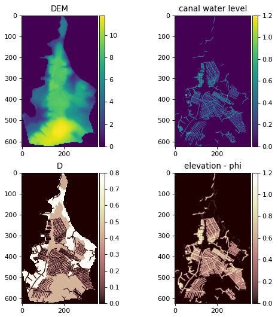

# Drained Peat Canal Block Simulator

Drained Peat Canal Block Simulator is an open-source model that developed based on research by [Urzainki et al (2020)](https://doi.org/10.5194/bg-17-4769-2020). This model simulates water table depth in peatland areas with canal networks to assess the impact of canal blocking on restoration efforts. The simulation results show how blocking canals reduces carbon emissions from peat decomposition.

## Getting Started

### What you know before you start

This script runs on Python 3, while some other models may still use Python 2. Users should have some basic knowledge of Python. If you're new to Python, it's recommended to start with the [official Python tutorial](https://docs.python.org/3/tutorial/). You'll need to know how to read and write data from files.

The script is designed to be easy to use, you can simply change the main parameters to run it. However, if you want to fully understand the script, it's helpful to use a preferred [integrated development environment (IDE)](https://github.com/learn-co-curriculum/your-integrated-development-environment). This way, you can easily run and understand each line of the script.

### Installation

Before the model can be used, there are installation steps that you need to follow. Here's a step by step guide.

1.  Ensure [Python](https://www.python.org/downloads/) is intalled on your system.

2.  Install [miniconda](https://githubminicondacom/SmithsonianWorkshops/CodingInPython/blob/master/Week%200/Installing%20miniconda%20on%20Windows.md) and run the Anaconda prompt.

3.  Create a new environment within conda with some packages needed

```         
conda create -n [name of environment] python=3 fipy rasterio pandas xlrd
```

4.  Activate the new environment created

```         
conda activate [name of environment]
```

4.  To run the model, you can utilize an integrated development environment (IDE) like [Spyder](https://github.com/spyder-ide/spyder). Here's a step-by-step guide to installing Spyder via conda.

```         
conda create -c conda-forge -n spyder-env spyder numpy scipy pandas matplotlib sympy cython
```

### Check when the model is properly installed

To check the installation, here is a step-by-step guide. The following steps are for Spyder IDE, but you can use another IDE (Visual Studio Code, PyCharm, etc.).

1.  Launch the IDE first, either from the application icon or via Anaconda Prompt.

```         
Spyder
```

2.  After Spyder opens, (1) open the main.py file, (2) ensure the main.py tab is selected, and (3) run the model and wait for the output.

    

3. The correct installation will resulted the plot below.
{width="612"}

------------------------------------------------------------------------

4. The model output includes four main maps: DEM, canal water level, D, and elevation-phi. The DEM shows the height of the peat surface and helps understand water flow and how canal blocks affect water levels. The canal water level (CWL) measures water in the canal network, starting out even but changing after blocks are added, which then affects water table depth (WTD) in the model. D indicates transmissivity, a parameter to see how easily water moves through the peat, based on the slope between the water table depth and the peat surface. Elevation-phi's plot shows the difference between land height and water table depth, with positive values indicating areas where dry peat can form.

5. If the plot result doesn't show up or an error message occurs, please investigate and refer to the [common error solutions](https://github.com/icraf-indonesia/drained_peat_canal_block/blob/write-readme/src/common-error.md). If the error persists, attempt to debug the script.

## Data & Parameters

The script needs the following data to run.

| No  | Data                                  | Type    | Format  | Parameter           | Description                                                                                                                                                                                                                                                                                                                                                   | Unit                                     |
|------|------|------|------|------|------------------------------------|------|
| 1   | Elevation map                         | Raster  | GeoTIFF | `dem_rst_fn`        | elevation data for the entire study area                                                                                                                                                                                                                                                                                                                      | meters (*m*)                             |
| 2   | Peat canal network map                | Raster  | GeoTIFF | `can_rst_fn`        | indicates the location of canals within the study area                                                                                                                                                                                                                                                                                                        | integer (*1:canal present & 0:no canal*) |
| 3   | Peat depth and soil type map          | Raster  | GeoTIFF | `peat_depth_rst_fn` | information about the depth of the peat layer at each location                                                                                                                                                                                                                                                                                                | meters (*m*)                             |
| 4   | Daily precipitation                   | Tabular | .xlsx   | `rainfall_fn`       | excel file containing daily precipitation data for the simulation period                                                                                                                                                                                                                                                                                      | milimeters per day (*mm/day*)            |
| 5   | Information about specific parameters | YAML    | .yml    | `params_fn`         | The specific parameters: block_height (*m*), canal_water_level (m), diri_bc (the dirichlet boundary condition value, *m*), hini (the initial hydraulic head, *m*), P (average precipitation rate, *mm/day*), ET (evapotranspiration rate, *mm/day*), timeStep (time step for the transient simulation, in days), & Kadjust (hydraulic conductivity, unitless) | multi-unit                               |

In addition to the required data, several parameters must be defined to run the model. These parameters need to be set in the main.py file before running the model. The parameters should be adjusted according to the simulation scenario that the user wants to run. The following table lists these parameters.

| No  | Parameter Name                                         | Description                                                                                                                                                                                                                 | Format                              | Unit                                |
|----------|----------|---------------------------------|----------|----------|
| 1   | `DAYS`                                                 | Number of days to simulate the model                                                                                                                                                                                        | Integer                             | days                                |
| 2   | `N_BLOCKS`                                             | Number of canal blocks to be placed in the peatland                                                                                                                                                                         | Integer                             | number of blocks                    |
| 3   | `N_ITER`                                               | Number of iterations for the Monte Carlo simulation or optimization algorithm, influencing the search for optimal dam placements. In the case of Monte Carlo, this specifies how many random dam configurations to evaluate | Integer                             | number of iterations or generations |
| 4   | `track_WT_drained_area` and `track_WT_notdrained_area` | Coordinates (row and column) of specific pixels within the DEM, allowing you to monitor the water table depth at specific locations and analyze the spatial variability of rewetting                                        | Tuple of two integers (row, column) | pixel coordinates                   |
| 5   | `hand_made_dams`                                       | A Boolean flag indicating whether to use hand-picked dam locations for evaluation instead of using the optimization algorithms or random placement.                                                                         | Boolean                             | `True` or `False`                   |

### Data & Parameters Preparation

There are certain guidelines you need to follow to prepare data for simulation.

1.  Define the area of interest (AOI) by providing a base map that will be used as a reference for all raster data. This ensures that all raster data will share the same extent, cell size, and number of columns and rows after being clipped by the base map. This consistency is essential for uniform data processing in the model.

2.  For optimal model results, use **locally available data** or other locally relevant data, especially for the peat type and canal network data raster. If local data is limited, alternative sources can be used. For elevation data, consider sources like SRTM, DEMNAS, etc. For soil type data, consider sources like USDA, etc.

3.  To prepare the precipitation data, use data from a nearby weather station in the study site. If no local data is available, use [Ogimet](https://www.ogimet.com/home.phtml.en), following the provided [Ogimet tutorial](https://www.ogimet.com/gsynres.phtml.en). Ensure preparation for precipitation tabular data aligns with the template references for [`rainfall_fn`](https://github.com/icraf-indonesia/drained_peat_canal_block/blob/main/data/original_data/params.xlsx)

4.  The list of parameters in the [YAML file]() below should be filled according to the user's desired scenario. This parameterization process will be relevant if consulted with an expert. If expert consultation is not possible, please refer to the original publication for guidance.

    

## How to simulate canal blocking?

This model can simulate peat water table depth with or without canal blocking. The parameter directly controlling the activation and deactivation of canal blocking is `hand_made_dams` in `main.py`.

1.  Setting `hand_made_dams` to `True` enables simulations with canal blocking at specified locations defined by the user beforehand.

2.  Setting `hand_made_dams` to `False` disables simulations with canal blocking at user-defined specified locations, resulting in two available options.:

    a.  If `N_BLOCK > 0`, canal block locations will be generated randomly.

    b.  if `N_BLOCK = 0`, simulations will run without any canal block installed.

When the `hand_made_dams` parameter is set to `True`, the process to select the canal block is illustrated by the following image. First, the canal network raster, which contains cell values of 1 for canal and 0 for non-canal, is reclassified. All cells with a value of 1 are then reclassified to unique numbers in ascending order. The number value of each canal cell in the reclassified raster is then used to pick the location of the canal block. Finally, the selected number is inputted into the model for the parameter `hand_picked_dams`.


## Reference

Urzainki, I., LaurC)n, A., Palviainen, M., Haahti, K., Budiman, A., Basuki, I., Netzer, M. and HC6kkC\$, H., 2020. Canal blocking optimization in restoration of drained peatlands. Biogeosciences, 17(19), pp.4769-4784.
